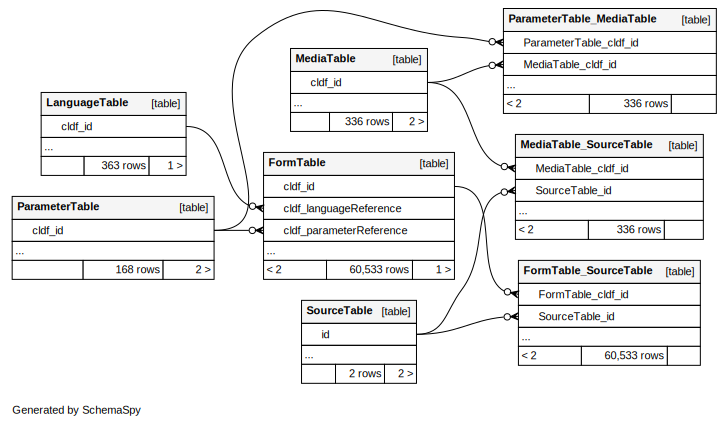

# CLDF dataset derived from Grierson's "Linguistic Survey of India" from 1928

## How to cite

If you use these data please cite
- the original source
  > Grierson, George Abraham (1928): Linguistic Survey of India. Comparative Vocabulary. Calcutta: Government of India Central Publication Branch.
- the derived dataset using the DOI of the [particular released version](../../releases/) you were using

## Description

This dataset is licensed under a https://creativecommons.org/licenses/by-nc/4.0/ license

Available online at https://lsi.clld.org

Conceptlists in Concepticon:
- [Grierson-1928-168](https://concepticon.clld.org/contributions/Grierson-1928-168)
## Notes

The following considerations went into creating the [orthography profiles](etc/orthography):

Grapheme | IPA | Comment
--- | --- | ---
V | v | typically common in Indian languages. Alternates between v and w
^A | ɑ | a in America or u in hurry
a | ə | a in America or u in hurry
à͛ | à͛/a | Occurs twice in Pwo-Bassein. No explanation
ā | aː | a in America or u in hurry
ǟ | ǟ/æ | lengthened ɛ. ɛː
ǎ̀ | ǎ̀/a | occurs in Katurr Palaung. A short version of a. ă
ạ̄ | ạ̄/aː | Palaung. u in but (ʌː)
ạ̌ | ạ̌/a | Only occurs in Syrian Gypsy)
ḅ | ḅ/b | A peculiar labial according to Grierson, unvoiced may be)
ḇ | ḇ/b | Another variety of sound. Occurs in Tailang)
c̣ | c | No mention in the book. Based on context, treat it as ch ~ tɕ)
ḥ̣ | h | A sound equivalent to visarga in Sanskrit. Essentially h)
ī̃° | ī̃°/ĩ | actually a glottal check)
ī̇  | ɪː | Only occurs once in Mandarin)
ï̌ | ï̌/ɪ | Centralized vowel (may be) occurring once in Prakrit)
ị̄ | ị̄/ɪː | Occurs in Palaung. Supposed to be a modification of ī)
i̯ | i̯/j | Occurs only in Cham. no explanation given. Is it non-syllabic?)
ḷ’ | ɭ̥ | supposed to be a breathy voiced ɭ)
m̊° | m̥ | mˤ (Should be a glottal check according the book. ˤ)
m̌ | m̌/m | Occurs in Singhalese. No description given in Grierson)
n | n̪ | not clear if this should be a dental sound. Tamil has an alveolar stop. In general dental nasal stops are present in Indian languages)
ṅ̇ | ṅ̇/n | Typo in the data. Should be treated as velar nasal ŋ
r | r/ɾ | possibly a flap for Tamil/malayalam. Rest of languages, it could be r. No explanation in the book.
ṛ’ | ɽ̊ | weak aspiration
r̤ | r̤/r ɻ | retroflex approximant occurs in Malayalam and Tamil
ṟˡ | ṟˡ/r | trilled r
s̄ | s̄/s |  Typo in case of Anal, Bhojpuri
š́ | š́/ʃ | skh in Ormuri
ṣ̌ | ṣ̌/ʂ | sch in Ormuri
s̱ | s̱/s | part of ṯs̱
t̤ | t̤/t | tˤfor ط Arabic.
ū’ | ū’/uː | Only occurs in Sakai and Semang. SHould be treated as "uː h"
ǖ | ǖ/yː | long variant of ü (y)
v | v | ʋ typically common in Indian languages. Alternates between v and w
à | à/a | as in German Mann
è | è/e | no explanation in the book. Better go with e
é | é/e | no explanation in the book. Better go with e
ì | ì/i | no explanation in the book. Better go with i
í | í/i | no explanation in the book. Better go with i. Three instances
ï | ï/ɪ | a centralized vowel
ò | ò/o | Typo for ö in Yeinbå.
ó | ó/o | Occurs in Rong/Lepcha. Equivalent to o in "for" or "nor"
ô | ɔ | no sound in the original transcriptions. Occurs in the language name: Salôn
õ | õ | nasalized. No explanation but can assume...
ö̌ | ö̌/œ | (̈̌ü dipthong. A very short French eu followed by u. Found in Miao-Hmong
ù | ù/u | no explanation in the book. Better go with u
ú | ú/u | no explanation in the book. Better go with u
ü | y | y: is for German ubel
ė | ė/ə | No explanation. Only found once in Annamese (Vietnamese)
ě | ě/e | equivalent to ə. occurs in Katurr Palaung
ň | ň/n | no explanation in Grierson
ũ | ũ | probably nasalized vowel
ż | ż/z | no explanation in Grierson
ǎ | æ | parsing error. It is part of the ǎ̀ symbol
Ǐ | i | no explanation in Grierson
ǐ | ǐ/i | no explanation in Grierson
ǒ | ɒ | no explanation in Grierson
ǔ | ǔ/ʊ | short version of oo in soon, boon. ŏ
ǚ | ǚ/y̆ | extra short y
ȧ | ȧ/a | It should be å. It is not clearly printed in the original book
ȯ | o | Only occurs once in Shodochi for "ten".
ȳ | yː | not there in the book
ɯ | ɯ | Book shows this form
δ̤ | ðʰ | ðˤ version. Ẓāʾ in Modern Standard Arabic
δ̱ | d̪ | ˤ version of d̪
ḣ | ḣ/h | Typo. should be ḥ
ḥ | ḥ/h | A sound equivalent to visarga in Sanskrit. Essentially h
ḳ | ḳ/k | Occurs only in Salon. No explanation in the book
ṁ | ṁ/m | as a nasal vowel. typically nasalizes previous vowel and occurs in Sanskrit and borrowings
ṃ | ṃ/ṁ | Typo. should be rendered as ṁ
ṙ | ṙ/r | typo. should be rendered as ṛ
ṟ | ṟ/r | a trilled r
ṡ | ṡ/s | better shown as ʃ
ṫ | ṫ̪ | Could be a parsing error. Can't locate it
ạ | ạ/a | Less rounded ö. Occurs in SHAN. A slightly long variant occurs in Siamese. ø̜
ạ̄  | ạ̄/aː | ø̜ː in Siamese
ẹ | ẹ/ɚ | Gheko has this sound mainly. variant between i and e. So ɪ is a good candidate. Occurs in Avestan but no explanation.
ị | i | Occurs in Palaung. Supposed to be a modification of i
ụ | ụ/u | Less rounded ü. May be y̜. Occurs in Siamese and Shan
ꭓʷ | χʷ | xʷ labialized x
ꭓ́ | χ | kkh according to the book
^ō̂ | ō̂/oː | One occurrence in Guzuri of Hazara

## Coverage

## Data model

See [cldf/README.md](cldf) for a description of the tables and columns and the
entity-relationship diagram below for how they relate.

## Statistics

- **Varieties:** 363
- **Concepts:** 168
- **Lexemes:** 60,533
- **Sources:** 1
- **Synonymy:** 1.14
- **Invalid lexemes:** 0
- **Tokens:** 364,236
- **Segments:** 170 (0 BIPA errors, 0 CLTS sound class errors, 170 CLTS modified)
- **Inventory size (avg):** 42.32

# Contributors

Name               | GitHub user | Role
---                | ---         | ---
Grierson, George Abraham | | Author
Taraka Rama | @phylostar | Editor
Robert Forkel | @xrotwang | Editor
Johann-Mattis List | @lingulist | Editor

## CLDF Datasets

The following CLDF datasets are available in [cldf](cldf):

- CLDF [Wordlist](https://github.com/cldf/cldf/tree/master/modules/Wordlist) at [cldf/cldf-metadata.json](cldf/cldf-metadata.json)